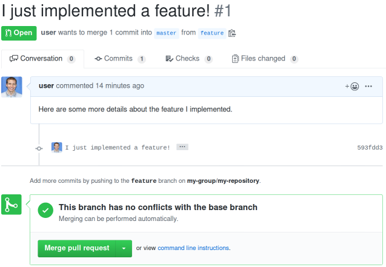

===================
Easy Merge Requests
===================

What is this?
-------------

This is a tool to make submitting merge requests to repos for which you already have access a little easier.

Supported features
``````````````````
* Open a merge request on any GitHub or GitLab instance, and, if specified, merge it

* Custom title or description

* Choose whether to squash the merge

* Derive the title, description, or branch name from the last commit
  message if any of these options are not given

Setup
-----

Installing the package
``````````````````````

In the project directory, run

.. code-block:: shell

    python setup.py install

Adding an access token
``````````````````````
Inside of a repository, on a branch that you do not mind merging (if unsure, create and use a private repository that
you don't care about), run :code:`easy-merge` with no arguments:

.. code-block:: shell

    easy-merge

If this is your first time using :code:`easy-merge` for the version control site that your project is hosted on, you
will be prompted for a personal access token token.

For `GitLab personal access tokens`_ (e.g.,
\https://<gitlab host>/profile/personal_access_tokens), the :code:`api` checkbox
needs to be checked.


For `GitHub personal access tokens`_ (e.g., \https://<github host>/settings/tokens/new, the :code:`repo` scope
checkboxes need to be checked.

.. _`GitLab personal access tokens`: https://gitlab.com/profile/personal_access_tokens
.. _`GitHub personal access tokens`: https://github.com/settings/tokens

How to use
----------

Let's say you are on a branch named :code:`feature` and you are ready to create
a merge request. Let's also say that this is the last commit message:

.. code-block::

    I just implemented a feature!
    Here are some more details about the feature I implemented.

It doesn't matter whether you are currently on the branch named :code:`feature`.
It doesn't even matter if a branch named :code:`feature` does not currently
exist (if it does not, the :code:`feature` branch will be created from the
:code:`master` branch).

Next, run:

.. code-block:: shell

    easy-merge -s feature

If everything is working, you will see something similar to the following output:

.. code-block::

    [user@computer]$ easy-merge -s feature
    Switched to a new branch 'feature'
    Enumerating objects: 1, done.
    Counting objects: 100% (1/1), done.
    Writing objects: 100% (1/1), 233 bytes | 233.00 KiB/s, done.
    Total 1 (delta 0), reused 0 (delta 0)
    remote:
    remote: Create a pull request for 'feature' on GitHub by visiting:
    remote:      https://github.com/my-group/my-repository/pull/new/feature
    remote:
    To github.com:my-group/my-repository.git
     * [new branch]      feature -> feature
    Created pull request!
    Skipping merge

If you navigate to \https://github.com/my-group/my-repository/pull/1
in a web browser, you should see something like this:


